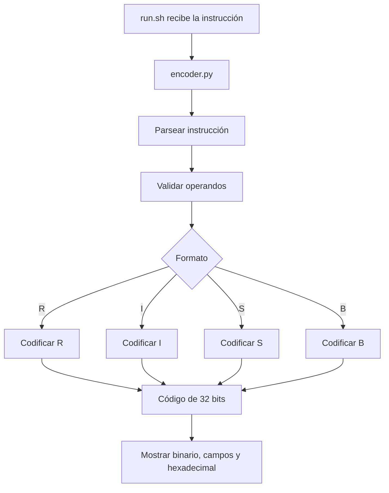

# Documentación técnica

## 1. Arquitectura del código

El proyecto fue implementado en Python y se divide principalmente en tres partes:

- `run.sh`: punto de entrada de la herramienta.
- `encoder.py`: contiene el procesamiento, validación, codificación y visualización de las instrucciones.
- `validacion/`: contiene los casos y herramientas utilizadas para comparar el codificador contra el toolchain oficial de RISC-V.

El flujo general del programa es el siguiente:



### Funciones principales

El archivo `encoder.py` contiene las siguientes funciones principales:

- `parsear_registro()`: convierte registros escritos como `x0` a `x31` a su valor numérico y verifica que estén dentro del rango permitido.
- `parsear_inmediato()`: convierte el inmediato recibido a un número entero.
- `parsear_memoria()`: procesa operandos de memoria con la forma `inmediato(registro)`.
- `parsear_instruccion()`: identifica la instrucción y obtiene los operandos necesarios según su tipo.
- `validar_inmediato_12()`: verifica el rango de los inmediatos utilizados en instrucciones tipo I y S.
- `validar_inmediato_b()`: verifica el rango y alineamiento de los desplazamientos de instrucciones tipo B.
- `codificar_r()`: construye las instrucciones de formato R.
- `codificar_i()`: construye las instrucciones de formato I.
- `codificar_s()`: construye las instrucciones de formato S.
- `codificar_b()`: construye las instrucciones de formato B.
- `codificar_instruccion()`: selecciona el codificador adecuado según el formato.
- `obtener_campos_r()`, `obtener_campos_i()`, `obtener_campos_s()` y `obtener_campos_b()`: obtienen los campos que se muestran al usuario.
- `imprimir_tabla_campos()`: muestra los campos de la instrucción junto con su posición, valor binario, valor decimal y descripción.
- `main()`: controla la ejecución general del programa.

### Decisiones de diseño

Se decidió utilizar una tabla llamada `INSTRUCCIONES` para almacenar el formato, `opcode`, `funct3` y `funct7` de cada instrucción.

Esto evita repetir estos valores dentro de cada función de codificación y permite que las instrucciones que comparten formato utilicen el mismo procedimiento.

La codificación se realiza mediante operaciones a nivel de bits. Cada campo se desplaza hasta la posición que le corresponde dentro de la instrucción y luego se combina utilizando OR a nivel de bits.

Por ejemplo, una instrucción R se construye siguiendo la distribución:

```text
funct7 | rs2 | rs1 | funct3 | rd | opcode
31-25    24-20 19-15 14-12   11-7  6-0
```

También se separó el procesamiento de la instrucción de su visualización. Primero se obtiene el valor completo de 32 bits y posteriormente se generan los campos utilizados para mostrar la explicación al usuario.

Los inmediatos negativos se representan utilizando complemento a dos. Para los formatos I y S se conservan los 12 bits menos significativos del inmediato. En formato B se utilizan 13 bits antes de distribuir las partes del desplazamiento en sus posiciones correspondientes.

---

## 2. Instrucciones soportadas y campos de codificación

El proyecto soporta las 12 instrucciones requeridas del subconjunto RV32I.

| Instrucción | Formato | opcode | funct3 | funct7 |
|---|---|---|---|---|
| `add` | R | `0110011` | `000` | `0000000` |
| `sub` | R | `0110011` | `000` | `0100000` |
| `and` | R | `0110011` | `111` | `0000000` |
| `or` | R | `0110011` | `110` | `0000000` |
| `addi` | I | `0010011` | `000` | - |
| `andi` | I | `0010011` | `111` | - |
| `lw` | I | `0000011` | `010` | - |
| `lb` | I | `0000011` | `000` | - |
| `sw` | S | `0100011` | `010` | - |
| `sb` | S | `0100011` | `000` | - |
| `beq` | B | `1100011` | `000` | - |
| `bne` | B | `1100011` | `001` | - |

### Fuente consultada

Los formatos de instrucción y los valores de `opcode`, `funct3` y `funct7` fueron obtenidos del manual oficial de la arquitectura RISC-V:

**Andrew Waterman y Krste Asanović. _The RISC-V Instruction Set Manual, Volume I: User-Level ISA_. RISC-V Foundation, Document Version 20191213, 2019.**

También se consultaron las tablas oficiales del conjunto de instrucciones RV32I publicadas por RISC-V International, específicamente las secciones correspondientes a **RV32I Base Integer Instruction Set** y **RV32/64G Instruction Set Listings**.

### Formato R

Utilizado por:

- `add`
- `sub`
- `and`
- `or`

Distribución:

```text
31       25 24    20 19    15 14   12 11     7 6       0
+----------+--------+--------+-------+---------+---------+
|  funct7  |  rs2   |  rs1   |funct3|   rd    | opcode  |
+----------+--------+--------+-------+---------+---------+
```

### Formato I

Utilizado por:

- `addi`
- `andi`
- `lw`
- `lb`

Distribución:

```text
31              20 19    15 14   12 11     7 6       0
+-----------------+--------+-------+---------+---------+
|    imm[11:0]    |  rs1   |funct3|   rd    | opcode  |
+-----------------+--------+-------+---------+---------+
```

El inmediato es un valor con signo de 12 bits.

### Formato S

Utilizado por:

- `sw`
- `sb`

Distribución:

```text
31       25 24    20 19    15 14   12 11       7 6       0
+----------+--------+--------+-------+-----------+---------+
| imm[11:5]|  rs2   |  rs1   |funct3| imm[4:0]  | opcode  |
+----------+--------+--------+-------+-----------+---------+
```

El inmediato de 12 bits se divide en dos partes dentro de la instrucción.

### Formato B

Utilizado por:

- `beq`
- `bne`

Distribución:

```text
31   30      25 24    20 19    15 14   12 11    8 7    6       0
+---+----------+--------+--------+-------+--------+----+---------+
|12 | imm[10:5]|  rs2   |  rs1   |funct3|imm[4:1]| 11 | opcode  |
+---+----------+--------+--------+-------+--------+----+---------+
```

El desplazamiento de las instrucciones de salto se almacena en diferentes posiciones del formato. El bit 0 no se guarda debido a que los desplazamientos válidos son múltiplos de 2.

---

## 3. Ejemplos de salida

A continuación se muestra un ejemplo para cada uno de los cuatro formatos implementados.

### 3.1 Formato R

Instrucción:

```bash
./run.sh "add x5, x6, x7"
```

Salida:

```text
Instrucción: add x5, x6, x7
Formato: R
Binario: 00000000011100110000001010110011

Campos de la instrucción:
-----------------------------------------------------------------------------------------------
Campo       Bits      Binario         Decimal   Descripción
-----------------------------------------------------------------------------------------------
funct7      31-25     0000000         0         Junto con funct3 identifica la operación add
rs2         24-20     00111           7         Segundo registro fuente: x7
rs1         19-15     00110           6         Primer registro fuente: x6
funct3      14-12     000             0         Junto con funct7 identifica la operación add
rd          11-7      00101           5         Registro destino: x5
opcode      6-0       0110011         51        Identifica el tipo general de operación
-----------------------------------------------------------------------------------------------
HEX: 0x007302B3
```

### 3.2 Formato I

Instrucción:

```bash
./run.sh "addi x10, x1, -12"
```

Salida:

```text
Instrucción: addi x10, x1, -12
Formato: I
Binario: 11111111010000001000010100010011

Campos de la instrucción:
-----------------------------------------------------------------------------------------------
Campo       Bits      Binario         Decimal   Descripción
-----------------------------------------------------------------------------------------------
imm[11:0]   31-20     111111110100    -12       Valor inmediato usado por addi: -12
rs1         19-15     00001           1         Registro fuente: x1
funct3      14-12     000             0         Identifica la operación addi
rd          11-7      01010           10        Registro destino: x10
opcode      6-0       0010011         19        Identifica el tipo general de operación
-----------------------------------------------------------------------------------------------
HEX: 0xFF408513
```

### 3.3 Formato S

Instrucción:

```bash
./run.sh "sw x8, -4(x2)"
```

Salida:

```text
Instrucción: sw x8, -4(x2)
Formato: S
Binario: 11111110100000010010111000100011

Campos de la instrucción:
-----------------------------------------------------------------------------------------------
Campo       Bits      Binario         Decimal   Descripción
-----------------------------------------------------------------------------------------------
imm[11:5]   31-25     1111111         127       Parte alta del desplazamiento -4
rs2         24-20     01000           8         Registro que contiene el dato a guardar: x8
rs1         19-15     00010           2         Registro base de la dirección: x2
funct3      14-12     010             2         Identifica la operación sw
imm[4:0]    11-7      11100           28        Parte baja del desplazamiento -4
opcode      6-0       0100011         35        Identifica una instrucción de almacenamiento
-----------------------------------------------------------------------------------------------
HEX: 0xFE812E23
```

### 3.4 Formato B

Instrucción:

```bash
./run.sh "beq x1, x2, 8"
```

Salida:

```text
Instrucción: beq x1, x2, 8
Formato: B
Binario: 00000000001000001000010001100011

Campos de la instrucción:
-----------------------------------------------------------------------------------------------
Campo       Bits      Binario         Decimal   Descripción
-----------------------------------------------------------------------------------------------
imm[12]     31        0               0         Bit 12 del desplazamiento 8
imm[10:5]   30-25     000000          0         Bits 10 a 5 del desplazamiento 8
rs2         24-20     00010           2         Segundo registro a comparar: x2
rs1         19-15     00001           1         Primer registro a comparar: x1
funct3      14-12     000             0         Identifica la condición beq
imm[4:1]    11-8      0100            4         Bits 4 a 1 del desplazamiento 8
imm[11]     7         0               0         Bit 11 del desplazamiento 8
opcode      6-0       1100011         99        Identifica una instrucción de salto condicional
-----------------------------------------------------------------------------------------------
HEX: 0x00208463
```

---

## 4. Validación contra el toolchain oficial

La implementación fue validada utilizando el assembler y `objdump` del toolchain GNU de RISC-V.

Para cada una de las 12 instrucciones se crearon tres casos propios de prueba, obteniendo un total de 36 casos.

Dependiendo del tipo de instrucción se utilizaron diferentes escenarios:

- Valores normales.
- Inmediatos positivos.
- Inmediatos negativos.
- Valores límite.
- Uso de los registros `x0` y `x31`.
- Desplazamiento cero en instrucciones de salto.

Cada instrucción fue ensamblada utilizando RV32I:

```bash
riscv64-unknown-elf-as -march=rv32i -mabi=ilp32
```

Posteriormente se obtuvo su codificación utilizando:

```bash
riscv64-unknown-elf-objdump -d
```

El script `validacion/validar.py` automatiza este procedimiento y compara el hexadecimal obtenido mediante el toolchain contra la línea `HEX: 0xXXXXXXXX` producida por el codificador.

El resultado final fue:

```text
36/36 casos correctos
```

Por lo tanto, los 36 casos evaluados coincidieron con la codificación producida por el toolchain.

Los casos utilizados pueden consultarse en:

`validacion/casos_prueba.txt`

La evidencia completa de la comparación se encuentra en:

[`validacion/resultados.txt`](validacion/resultados.txt)

En dicho archivo se registra para cada caso:

- La instrucción.
- El resultado generado por el modelo.
- El resultado obtenido mediante `objdump`.
- Si ambos resultados coinciden.

---

## 5. Instalación, preparación y uso

### Requisitos

Para ejecutar la herramienta se requiere:

- Python 3.
- Bash.

No se utilizan dependencias externas de Python.

Para realizar la validación también se requiere el toolchain GNU de RISC-V.

### Instalación del toolchain

En Ubuntu o WSL:

```bash
sudo apt update
sudo apt install gcc-riscv64-unknown-elf binutils-riscv64-unknown-elf
```

El toolchain puede comprobarse mediante:

```bash
riscv64-unknown-elf-as --version
riscv64-unknown-elf-objdump --version
```

Aunque las herramientas utilizan el prefijo `riscv64-unknown-elf`, durante la validación se utilizan las opciones:

```text
-march=rv32i
-mabi=ilp32
```

para generar código correspondiente a RV32I.

### Preparación de la herramienta

El programa no necesita compilación ni instalación de paquetes adicionales.

`run.sh` es el punto de entrada de la herramienta. Si el sistema no conserva su permiso de ejecución, se puede restaurar con:

```bash
chmod +x run.sh
```

### Uso

La herramienta recibe una única instrucción como argumento:

```bash
./run.sh "<instruccion>"
```

Ejemplo:

```bash
./run.sh "add x5, x6, x7"
```

No se requiere ningún comando de ejecución alternativo.

Para más información sobre la preparación del entorno y las pruebas de verificación se puede consultar el archivo [`README.md`](README.md).